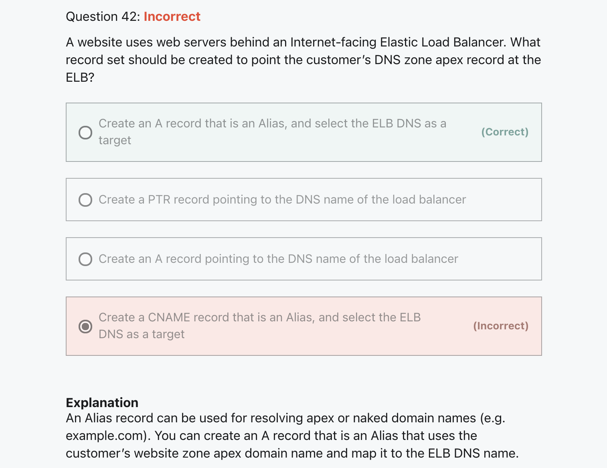
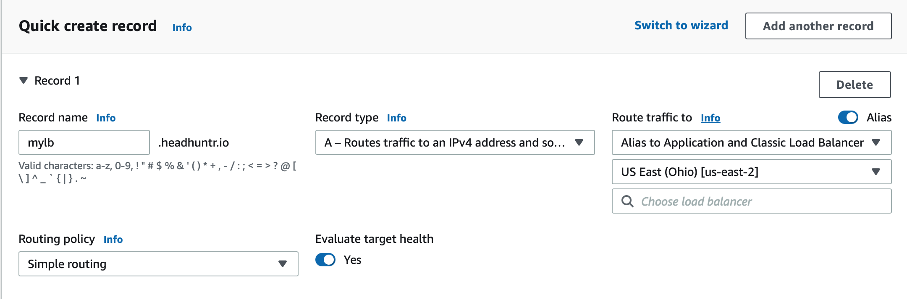
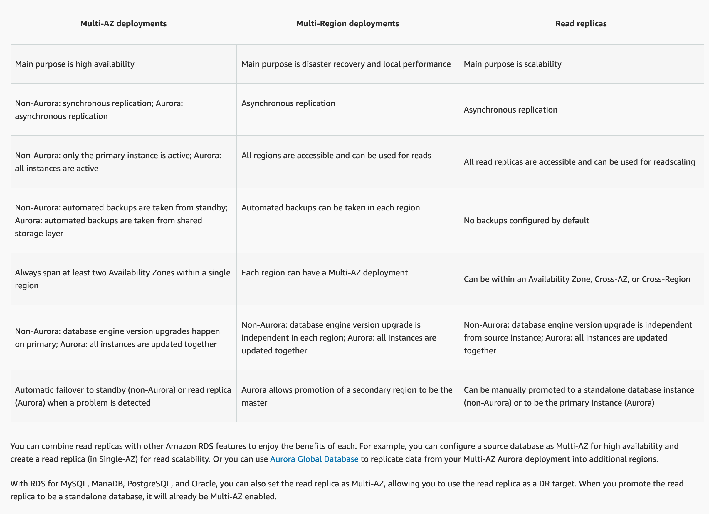
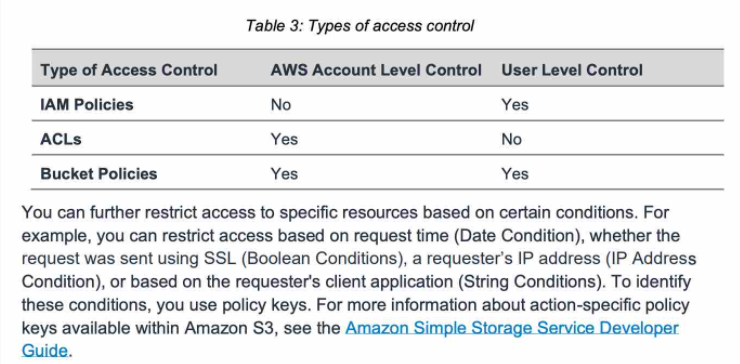

# Mistakes I commonly Make
Here's a long list of dumb mistakes I made over and over again

## 1. Route 53: A Record (Alias) is for Pointing to AWS Resources
And remember CNAME => OTHER DNS RECORD

## 2. RDS Replication
Only RDS Multi-AZ is Synced, But it sucks since its just standby

## 3. S3 Policies

## 4. Instance Tenancy
#### After you launch an instance, there are some limitations to changing its tenancy:
- [NO] default to anything
- [NO] anything to default
- [YES] dedicated to host
- [YES] from host to dedicated
