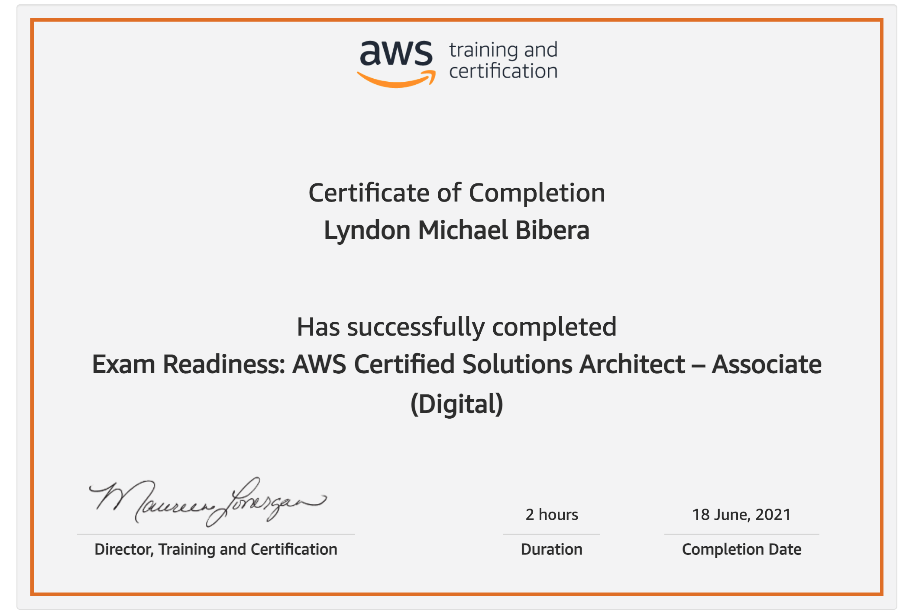
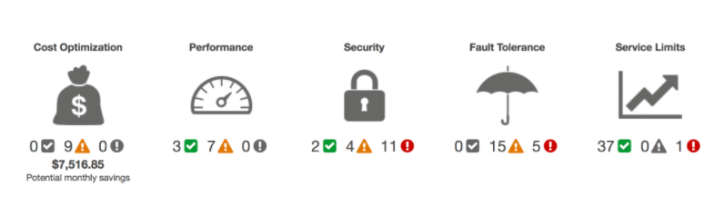

# AWS Solutions Architect Associte Exam
Starting point for the Exam Guide

## Domain 1: Design Resilient Architectures
- 1.1 Designa multi-tier architecture solution
- 1.2 Design highly availableand/or fault-tolerant architectures
- 1.3 Design decoupling mechanisms using AWS services
- 1.4 Choose appropriate resilient storage

## Domain 2: Design High-Performing Architectures
- 2.1 Identify elastic and scalable compute solutions for a workload
- 2.2 Select high-performing and scalable storage solutions for a workload
- 2.3 Select high-performing networking solutions for a workload
- 2.4 Choose high-performing database solutions for a workload

## Domain 3: Design Secure Applications and Architectures
- 3.1 Design secureaccessto AWS resources 
- 3.2 Design secure application tiers
- 3.3 Select appropriate data security options

## Domain 4: Design Cost-Optimized Architectures
- 4.1 Identify cost-effective storage solutions
- 4.2 Identify cost-effective compute and database services 
- 4.3 Design cost-optimized network architectures

#### S3

#### Trusted Advisor

#### Resources
- [AWS: Well-Architected Framework](https://aws.amazon.com/architecture/well-architected/?mkt_tok=MTEyLVRaTS03NjYAAAF9r5lapcAaUdC19zJRv2PivlG52SIQp6UfBACdPshVXwKTU9ozL9-c5OVrsFF_oV7s2wjFXB9gJkaDqMTrBJ3jPxwDzSOmAJwdtPYprzsU63AP2YUxQpWb&wa-lens-whitepapers.sort-by=item.additionalFields.sortDate&wa-lens-whitepapers.sort-order=desc)
